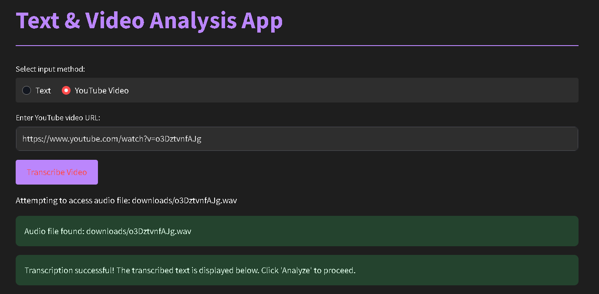
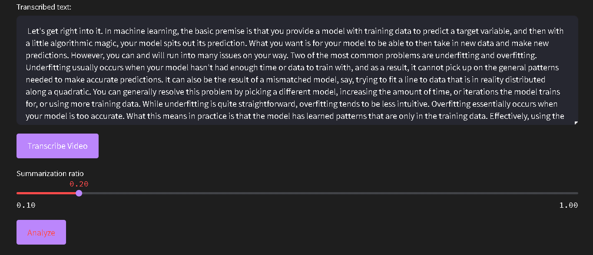

# Text And YouTube Video Analysis App

This is a Streamlit app that allows you to analyze text and YouTube video transcripts. It provides functionalities such as word frequency analysis, word cloud generation, sentiment analysis, and text summarization using Latent Semantic Analysis (LSA).

## Features

- **Text Input**: Enter any text to analyze.
- **YouTube Video Transcription**: Enter a YouTube video URL to transcribe its audio to text.
- **Word Frequency Analysis**: Displays the most common words in the text.
- **Word Cloud Generation**: Generates a word cloud from the text.
- **Sentiment Analysis**: Analyzes the sentiment of the text, providing polarity and subjectivity scores.
- **Text Summarization**: Summarizes the text using Latent Semantic Analysis (LSA).

## Installation

1. Clone the repository:
    ```bash
    git clone https://github.com/sanalpillai/Text-And-Youtube-Video-Analysis-App.git
    cd Text-And-Youtube-Video-Analysis-App
    ```

2. Create a virtual environment and activate it:
    ```bash
    python -m venv venv
    source venv/bin/activate  # On Windows use `venv\Scripts\activate`
    ```

3. Install the required packages:
    ```bash
    pip install -r requirements.txt
    ```

4. Install `ffmpeg`:
    - **Ubuntu/Debian**:
        ```bash
        sudo apt-get install ffmpeg
        ```
    - **MacOS**:
        ```bash
        brew install ffmpeg
        ```
    - **Windows**:
        Download from [FFmpeg](https://ffmpeg.org/download.html) and add it to your PATH.

## Usage

1. Run the Streamlit app:
    ```bash
    streamlit run text_analysis_app.py
    ```

2. Open your web browser and go to `http://localhost:8501`.

## File Structure

- `text_analysis_app.py`: Main application file.
- `requirements.txt`: Required Python packages.
- `downloads/`: Directory where downloaded audio files are stored.
- `Screenshots/`: Directory containing example screenshots.

## How to Use

1. **Text Analysis**:
    - Select "Text" as the input method.
    - Enter your text in the provided text area.
    - Click "Analyze" to see the results.

2. **YouTube Video Analysis**:
    - Select "YouTube Video" as the input method.
    - Enter the YouTube video URL.
    - Click "Transcribe Video" to transcribe the audio to text.
    - Once the transcription is complete, click "Analyze" to see the results.

## Example

### UI Overview



### Analysis and Word Count


### Text Summary


### Word Frequency and Sentiment Analysis


## Contributing

Contributions are welcome! Please open an issue or submit a pull request for any improvements or bug fixes.

## License

This project is licensed under the MIT License. See the [LICENSE](LICENSE) file for details.

## Acknowledgements

- [Streamlit](https://streamlit.io/)
- [yt-dlp](https://github.com/yt-dlp/yt-dlp)
- [Whisper](https://github.com/openai/whisper)
- [FFmpeg](https://ffmpeg.org/)
- [TextBlob](https://textblob.readthedocs.io/en/dev/)
- [WordCloud](https://github.com/amueller/word_cloud)
- [Sumy](https://github.com/miso-belica/sumy)
